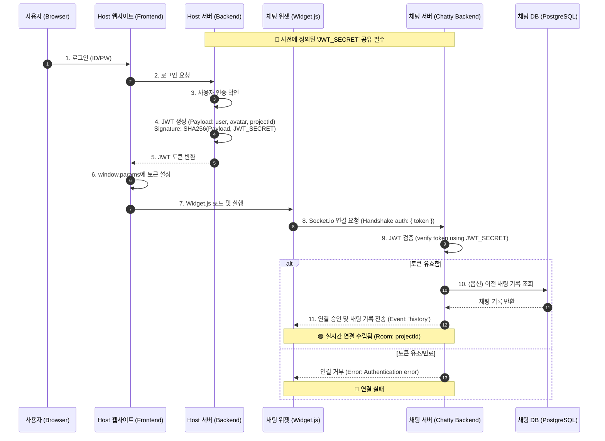
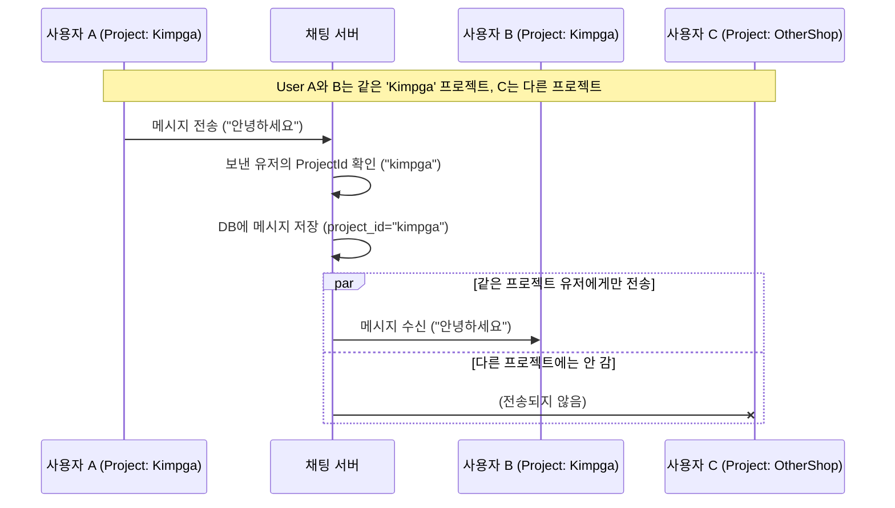

# Chatty 시스템 아키텍처 및 플로우

이 문서는 Host 웹사이트(예: 김프가)와 Chatty(채팅 솔루션) 간의 인증 및 메시지 처리 흐름을 설명합니다.

## 1. 핵심 개념
-   **Shared Secret (공유 비밀키)**: Host 서버와 Chat 서버가 서로 신뢰하기 위해 공유하는 비밀키입니다. 이 키가 일치해야 인증이 성립됩니다.
-   **JWT (JSON Web Token)**: 사용자 정보와 프로젝트 ID를 담고 있는 암호화된 토큰입니다. Host가 발급하고 Chat 서버가 검증합니다.
-   **Socket.IO**: 실시간 양방향 통신을 담당하는 프로토콜입니다.

## 2. 환경 변수 설정 (.env)
프로젝트 루트에 `.env` 파일을 생성하여 다음 변수들을 설정해야 합니다.

```env
POSTGRES_USER=postgres
POSTGRES_PASSWORD=postgres
POSTGRES_DB=chatty
DB_HOST=db
DB_PORT=5432
JWT_SECRET=your-secret-key-shared-with-host
PORT=3000
```

## 3. 전체 인증 및 연결 플로우 (Sequence Diagram)



## 3. 단계별 상세 설명

### Phase 1: 인증 및 토큰 발급 (Steps 1~5)
1.  사용자가 김프가(Host) 사이트에 로그인합니다.
2.  **김프가 서버**는 사용자가 맞는지 확인한 후, **채팅용 JWT 토큰**을 생성합니다.
    -   이때, 우리 채팅 서버와 약속한 `JWT_SECRET` 키를 사용하여 서명합니다.
    -   토큰 내부(`payload`)에는 `username`(닉네임), `projectId`("kimpga") 등의 정보를 담습니다.

### Phase 2: 위젯 초기화 (Steps 6~7)
1.  김프가 프론트엔드 페이지는 서버로부터 받은 토큰을 자바스크립트 변수(`window.params.token`)에 할당합니다.
2.  그리고 `widget.js` 스크립트를 로드합니다.

### Phase 3: 연결 및 검증 (Steps 8~11)
1.  위젯이 실행되면 즉시 채팅 서버(`CHAT_SERVER_URL`)로 Socket.io 연결을 시도합니다. 이때 `auth` 패킷에 토큰을 같이 보냅니다.
2.  **채팅 서버**는 받은 토큰을 자신이 알고 있는 `JWT_SECRET`으로 풀어봅니다.
    -   풀리면? → "아, 김프가에서 보증한 홍길동 유저구나!" → **접속 허용 & 해당 프로젝트 방(Room) 입장**.
    -   안 풀리면? → "누구세요?" → **접속 차단**.

## 4. 메시지 전송 플로우


